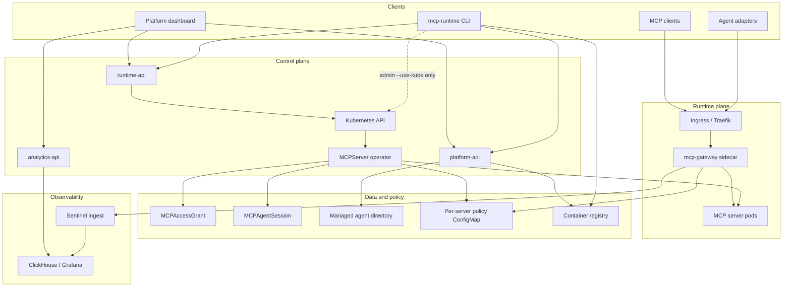

# Architecture

MCP Runtime has four planes: control, runtime, data and policy, and
observability. The linked guides at the end cover each part in detail.

## Planes

The `/api/v1` surface is served by three services behind Traefik path routing:
**platform-api** (identity, auth, registry authorization, admin), **runtime-api**
(servers, grants, sessions, deployments, adapter sessions), and **analytics-api**
(events, stats, usage). See [Sentinel](sentinel.md) for the per-service route and
RBAC split.

## What each layer owns

| Layer | Owns | Read next |
|-------|------|-----------|
| **Runtime** | Bootstrap, setup, registry workflow, `MCPServer` reconciliation, grants/sessions, rollout | [Runtime](runtime.md) |
| **Sentinel** | Gateway sidecar policy enforcement, analytics ingest, dashboards | [Sentinel](sentinel.md) |
| **Split APIs** | platform-api (teams, identity, registry authz), runtime-api (deploy/push, grants, adapter sessions), analytics-api (events, usage) | [API](api.md), [Sentinel](sentinel.md) |
| **Multi-team** | Namespace isolation, team RBAC, Traefik watch scope | [Multi-Team Isolation](multi-team.md) |

## Typical request path

1. An MCP client (or agent adapter) calls `https://mcp.<domain>/<server>/mcp`.
2. Ingress routes to the server pod; the **mcp-gateway** sidecar evaluates
   `MCPAccessGrant` + `MCPAgentSession` policy before forwarding to the app.
3. Allowed tool calls emit analytics events through ingest → Kafka → processor
   → ClickHouse; Grafana surfaces usage and traces.

Local scaffolding commands (`server init`, `access grant init`, `access session init`)
write manifests on the workstation only; they do not call the platform API or
Kubernetes.

Control-plane changes (setup, `auth login`, `server deploy`, `access grant apply`,
and admin-only `access session apply`) flow through the CLI or the split APIs
into Kubernetes; the operator materializes Deployments, Services, Ingress, and
policy ConfigMaps. `auth login` authenticates against platform-api, while
server, grant, and session writes land on runtime-api. Sessions for agent
traffic are usually issued through
`POST /api/v1/runtime/adapter/sessions`; explicit session manifests are
admin-only. Admin-only `--use-kube` or `kubectl apply`
bypasses platform auth and requires operator RBAC.

See [Request Flows](internals/request-flows.md) for allow/deny sequence diagrams,
component-level paths, and E2E scenario mapping.

## Deployment shapes

| Shape | When to use | Guide |
|-------|-------------|-------|
| Kind + `--test-mode` | Local contributor development | [Contributor Local Kind](contributor/local-kind.md) |
| k3s lab (HTTP registry) | Single-node evaluation | [Deployment Targets - k3s lab](deployment-targets.md#k3s-lab-example) |
| k3s / on-prem + bundled HTTPS | Public domain with Let's Encrypt | [Deployment Targets](deployment-targets.md), [k3s Deployment Runbook](k3s-deployment-runbook.md) |
| Managed Kubernetes + external registry | EKS, GKE, AKS | [Deployment Targets - Managed Kubernetes](deployment-targets.md#managed-kubernetes) |

## Related reading

- [Getting Started](getting-started.md): install and first server
- [Publish an MCP Server](publish-mcp-server.md): metadata, build, push, deploy
- [Agent Adapters](agent-adapters.md): HTTP proxy
- [CLI](cli.md): command reference
- [Cluster Readiness](cluster-readiness.md): registry, DNS, TLS, node trust checks
