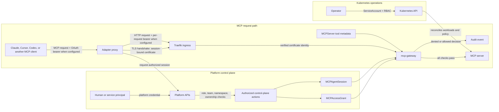
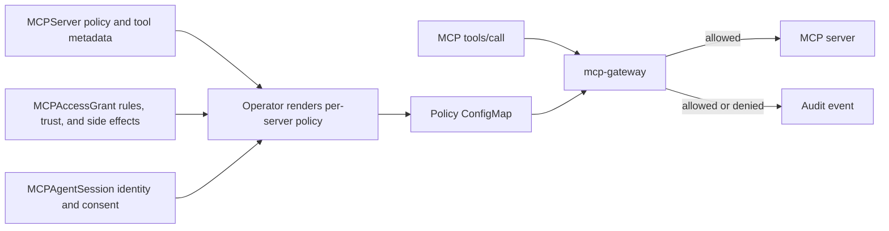

# Concepts

MCP Runtime has three Kubernetes resources (`MCPServer`, `MCPAccessGrant`,
`MCPAgentSession`), a managed agent directory in the platform API, and two
runtime components (the gateway and the adapter). For the full authorization
model, see
[Identity and authorization](identity-and-authorization.md).

## The whole thing, as a building

If it helps, think of the platform as an office building that rents suites to
tools and admits visiting agents:

| In the building | In MCP Runtime | What that means |
|---|---|---|
| A floor assigned to one company | **Namespace** (`mcp-team-acme`) | Groups a team's servers, grants, and secrets. Kubernetes RBAC, network policy, and platform API checks enforce the boundary. |
| The signed lease describing the suite | **`MCPServer`** | Declarative description: image, port, route, tools, policy, gateway on/off. |
| Facilities, who reads the lease and builds the room | **Operator** | Turns one `MCPServer` into a Deployment, Service, Ingress, and policy ConfigMap. |
| Lobby reception, pointing visitors to the right floor | **Traefik ingress** | Routes `/<server>/mcp` to the right Service and can verify adapter certificates. Per-tool authorization happens in the gateway. |
| The guard at the suite's own door | **`mcp-gateway` sidecar** | Evaluates configured policy for tool calls before forwarding them to the server. |
| The standing rule in the security handbook | **`MCPAccessGrant`** | Long-lived policy: which tools, up to what trust, with which side effects. |
| Today's visitor badge, expiring at 6pm | **`MCPAgentSession`** | Time-bounded record of delegated identity and consent; revocation reaches gateways after policy refresh, usually within about 10 seconds. |
| Clearance printed on the badge | **Trust level** (`low` / `medium` / `high`) | A ceiling, never a grant of power on its own. |
| "May look" vs "may edit" vs "may shred" | **Side effect** (`read` / `write` / `destructive`) | What the tool does to data, authorized separately from trust. |
| The badge carrier who presents your certificate | **Adapter** | Local proxy that enrolls and refreshes a session-bound client certificate. |
| Cameras and the logbook | **Sentinel** | Audit events, analytics, dashboards. |

## Platform trust model

MCP Runtime does not treat a caller as globally trusted because it has one valid
credential. A request crosses three separate identity and authorization planes:

1. **Platform control:** a user or service principal authenticates to the
   platform APIs. Its role, team membership, namespace scope, and resource
   ownership determine whether it can manage servers, grants, and sessions.
2. **MCP tool access:** a human delegates an agent's access through a grant.
   The platform issues a time-bound session for an authorized agent. The adapter
   proves that session with a certificate; on an OAuth-enabled server, the MCP
   request also carries a bearer token whose subject must match the session's
   human. The gateway checks the identity, session, grant, tool rules, declared
   side effect, and trust requirement on each tool call.
3. **Kubernetes operations:** the operator and other workloads use their own
   ServiceAccounts and RBAC to manage cluster resources. This authority is
   separate from both platform-user roles and agent access.



The adapter certificate proves **which delegated Runtime session is calling**;
it does not grant tools by itself and does not contain an OAuth token. When the
server enables OAuth, the client supplies a bearer on each HTTP request. Several
clients can use one adapter with different tokens only when each token is valid
for the same MCP resource and identifies the same human as the certificate-bound
session. If a token includes a team claim, it must also match the session's team.
Different Runtime agent identities need separate sessions and certificates. See
[Certificate identity and OAuth tokens](agent-adapters.md#certificate-identity-and-oauth-tokens)
for the request sequence.

The gateway is the tool-call enforcement point when the server uses allow-list
policy. An enabled grant and, when `session.required: true`, an active session
must match the caller and server. The grant must allow the tool and its
side-effect class, and effective trust must meet the tool's required level.
`server init` creates an allow-list policy with `defaultDecision: deny`, so
unmatched calls are rejected by default.
`policy.mode: observe` is an explicit exception: it permits calls without
enforcing those checks, while still recording decisions. A server with the
gateway disabled also has no gateway policy enforcement.

The rest of this guide breaks these checks down by resource. The detailed
identity fields, decision order, and denial reasons are in
[Identity and authorization](identity-and-authorization.md).

## MCPServer

An `MCPServer` is a Kubernetes CRD that describes a running MCP server: what image
to run, which port it listens on, how it routes traffic, and whether the governance
gateway is enabled.

When you run `mcp-runtime server deploy`, the operator reconciles an `MCPServer` into
a Kubernetes `Deployment`, `Service`, and `Ingress`. If you delete one of them, the
operator recreates it.

```yaml
# What the operator creates from one MCPServer
Deployment  → runs your server image
Service     → exposes it inside the cluster
Ingress     → routes /<server-name>/mcp to the Service
```

The `MCPServer` also carries policy settings: which tools are governed, what
trust levels they require, whether allow-list checks are enabled, and whether
the gateway runs in enforcement or observe mode.

## Managed agents

A managed agent is a platform directory record for a logical agent identity. It
is separate from the human who delegates access, the MCP client process that
sends a request, and any OAuth `client_id` used by that client.

Each record belongs to one team and has an immutable ID such as
`agt_01arz3ndektsv4rrffq69g5fav`, a changeable display name, and an active or
inactive status. The stable ID lets grants, sessions, audit events, and the
agent directory refer to the same identity even when the name or client changes.
Team ownership lets the platform check that an agent is being granted access by
and for the right team. The directory is governance metadata; the ID alone does
not authenticate a process or prove what software made a request.

Create or list records through the platform API using the CLI:

```bash
mcp-runtime agent create acme --name "Release assistant"
mcp-runtime agent list acme --status active
```

The create command prints the generated ID. Use that ID in `MCPAccessGrant`
subjects and in `mcp-runtime adapter proxy --agent <agent-id>`. A team owner or
platform administrator can create and manage records. Team members see active
agents only when an applicable grant or their own active session gives them
access; ask a team owner for an ID if the list is empty.

When an agent is deactivated, the platform marks the record inactive, refuses
new platform-backed grants, sessions, and certificate enrollments for it, and
revokes its active sessions across namespaces. The grants remain available for
history and must be disabled separately if you also need to remove standing
policy. Gateways apply session revocation after they load the updated policy,
usually within about 10 seconds. Direct Kubernetes writes bypass the directory
checks; use the platform API for managed agent access.

## MCPAccessGrant

A grant is a policy document that says: **"Agent X, acting for Team Y, is allowed
to call these tools on server Z, up to this trust level, with these side effects."**

Grants are scoped to a server and match a human, agent, team, or combination of
those identities. With allow-list policy and the default deny decision, a
caller without a matching grant cannot call tools.

```
MCPAccessGrant
  serverRef: payments          ← which server
  subject:
    agentID: agt_01arz3ndektsv4rrffq69g5fav  ← managed agent ID
    teamID: <globex-uuid>      ← which team (optional)
  maxTrust: low
  allowedSideEffects: [read]
  toolRules:
    - name: list_invoices      ← allowed
      decision: allow
      requiredTrust: low
    - name: delete_invoice     ← blocked
      decision: deny
```

Grants are created with `mcp-runtime access grant init` and applied with
`mcp-runtime access grant apply`. See [CLI reference: access](cli.md#access).

## MCPAgentSession

A session records a human, agent, and team identity for one server and a fixed
period. The grant is separate standing policy; an adapter-issued session is
created only when the platform finds a matching enabled grant. A session carries:

- `consentedTrust`: the trust ceiling the user consented to
- `expiresAt`: when the session ends (the agent must renew)
- `revoked`: set to `true` to block later calls after the gateway loads the updated policy, usually within about 10 seconds

When `session.required: true`, the gateway checks for a matching active session
on each tool call. A missing, expired, or revoked required session denies the
call. When sessions are optional, trust falls back to the grant's `maxTrust`.

```
MCPAgentSession
  serverRef: payments
  subject:
    agentID: agt_01arz3ndektsv4rrffq69g5fav
    teamID: <globex-uuid>
  consentedTrust: low          ← human approved this level
  expiresAt: 2030-06-02T12:00Z
  revoked: false
```

The adapter creates or reuses a session when it starts with `--server` and
`--agent`. `--auto-refresh` renews the adapter certificate before it expires; it
does not refresh the OAuth token. Create sessions manually only when an
administrator needs explicit control over expiry, trust ceiling, or revocation.

!!! tip "Why there are two resources"
    A grant is standing policy, like a rule in a security handbook. A session is
    today's visitor badge. A call needs both when the server requires sessions.
    Revocation changes policy for subsequent calls after gateways load the new
    revision; calls already in progress are not recalled.

## Grant or session: which one do I need?

| Scenario | Grant needed? | Session needed? |
|---|---|---|
| Agent calling tools on a server with allow-list policy | Yes | Yes when `session.required: true` |
| Agent calling tools on a server with optional sessions | Yes | No; trust falls back to the grant's `maxTrust` |
| Block an agent from a specific tool | Yes (deny rule) | — |
| Limit trust to `low` regardless of what the agent requests | Yes (`maxTrust`) | — |
| Time-limit an agent's access | — | Yes (`expiresAt`) |
| Revoke an agent's later calls | — | Yes (`revoked: true`; allow time for policy refresh) |
| Share one server between two teams | Yes (with `teamID`) | Yes (with `teamID`) |

## Trust levels

Trust is a ceiling, never a grant. The gateway computes two values and compares
them:

```text
effective = min(grant.maxTrust, session.consentedTrust)
required  = max(tool.requiredTrust, matchingToolRule.requiredTrust)
allowed   when effective >= required
```

Effective trust takes the **lower** of what policy permits and what a human
consented to, so either one can hold the line alone. Required trust takes the
**higher** of the tool's own bar and any tighter bar in the grant's tool rule, so
a grant can raise the price of a tool but never discount it.

| Level | Meaning |
|---|---|
| `low` | Read-only, reversible, low-risk operations |
| `medium` | Writes or operations with noticeable side effects |
| `high` | Destructive, irreversible, or high-impact operations |

Setting `maxTrust: low` on a grant means even if the agent claims `high` trust in
its session, the gateway caps it at `low`.

## Side effects

Side effects classify what a tool does to data. The grant must explicitly
allow the side-effect class before a call reaches the server.

| Value | When to use |
|---|---|
| `read` | Fetches or queries only; no state change |
| `write` | Creates, updates, or modifies records |
| `destructive` | Deletes, wipes, or makes irreversible changes |

A grant with `allowedSideEffects: [read]` blocks any tool whose metadata declares
`sideEffect: write` or `sideEffect: destructive`, even if that tool is in the
allow list. Trust and side effect are checked independently; both must pass.

!!! warning "Empty is not a wildcard"
    An omitted or empty `allowedSideEffects` authorizes **nothing**. A tool the
    server never declared is denied too (`tool_side_effect_unknown`): with no
    declared side effect, there is nothing for a grant to authorize.

## Policy engine

The policy engine is the `mcp-gateway` decision logic plus the per-server
policy document that the operator renders for it. It is not another CRD. The
operator combines the server's policy settings and tool metadata with matching
grants and sessions, then writes the result to a policy ConfigMap beside that
server.

For each MCP `tools/call`, the gateway identifies the caller, finds the named
tool in the server's declared tool inventory, and evaluates the applicable
policy:



In allow-list mode, the gateway checks identity, any required session, an
enabled matching grant, the tool rule, the declared side effect, and trust
before forwarding the call. The result is that server owners can change
permissions without changing server code, platform operators can keep the same
checks across servers, and each decision records a reason for later review.
`server init` scaffolds allow-list mode with a default deny decision. Use
`policy.mode: observe` to record what the policy would decide while allowing
calls during a rollout.

The engine evaluates the metadata it receives; it does not inspect a tool's
implementation or infer its real-world effects. Keep the declared tool names,
trust levels, and side effects aligned with the running server. Policy checks
apply only when the gateway is enabled and the server is using allow-list mode;
observe mode records decisions without blocking calls.

## The gateway

The gateway, `mcp-gateway`, is a sidecar container in each MCP server pod (when
`gateway.enabled: true` on the MCPServer). Traefik routes the public path to the
pod; `mcp-gateway` makes the authorization decision there before the request
reaches your server.

On each tool call the gateway:

1. Authenticates identity: OAuth bearer when `spec.auth` is set; for an adapter,
   resolves session identity from the verified client certificate (and binds the
   bearer subject to the session human when OAuth is also enabled)
2. Looks up the matching `MCPAccessGrant` and, when `session.required: true`, an active `MCPAgentSession` for that agent and server
3. Checks trust level, side-effect class, and per-tool allow/deny rules
4. Either forwards the call to your server or returns a denial with a reason code
5. Emits an analytics event with the decision

Your server code needs no changes to support the gateway.

!!! note "Two things are called \"gateway\""
    `mcp-gateway` is the per-server enforcement sidecar inside each MCP server pod.
    The Sentinel `gateway` Deployment is the Traefik ingress in front of the
    platform APIs, ingest, and UI. It routes traffic and makes no tool-call
    decisions.

## Adapter

The adapter is a local proxy that runs on the developer's machine (or inside an
agent process). It:

- Calls the platform API to create or reuse an authorized session
- Presents a certificate whose SPIFFE identity is bound to that session
- Forwards the local MCP client's OAuth bearer token when the target enables OAuth
- Refreshes the certificate automatically before it expires (`--auto-refresh`)

The adapter does not make authorization decisions; the gateway does.

```
Your MCP client → adapter proxy (localhost:8099) → gateway → MCP server
```

## Platform mode

Platform mode controls which namespace servers are published into and who can
browse the catalog without logging in.

| Mode | Who sees servers | Catalog namespace |
|---|---|---|
| `tenant` (default) | Only team members | Per-team namespaces |
| `org` | All signed-in users | `mcp-servers-org` |
| `public` | Anyone, no login | `mcp-servers-public` |

In `org` and `public` modes the catalog namespace is added to what a signed-in
user already sees, so their listings cover the shared catalog plus every team
namespace they are authorized for.

Set with `--platform-mode` on `setup` or `MCP_SETUP_PLATFORM_MODE` in your env file.

## Scopes

When publishing a server image (`server push`) or deploying a server
(`server deploy`), `--scope` controls which catalog namespace the server lands in:

| Scope | Namespace | Who can use it |
|---|---|---|
| `tenant` | `mcp-team-<slug>` | Members of that team |
| `org` | `mcp-servers-org` | All signed-in users in the org |
| `public` | `mcp-servers-public` | Anyone |

## What's in a `.mcp/servers.yaml`

The `.mcp/servers.yaml` file is the metadata file that `server init` creates.
It is the source of truth for your server's tool policy. The gateway enforces
what is declared here, and calls to unlisted tools are denied.

```yaml
servers:
  - name: payments
    image: registry.example.com/acme/payments
    imageTag: v1
    scope: tenant
    tools:
      - name: list_invoices      # must match the real tool name in your server
        requiredTrust: low
        sideEffect: read
      - name: create_invoice
        requiredTrust: medium
        sideEffect: write
    policy:
      mode: allow-list
      defaultDecision: deny      # deny everything not in the list
    session:
      required: true
    gateway:
      enabled: true
```

Use `server init --from-server http://localhost:8088` to generate this file
automatically from a running server's `tools/list` response rather than writing
it by hand. Then run `server validate` before deploying to catch mismatches.

!!! warning "`policy.mode: observe` is a migration tool, not a setting to leave on"
    Observe mode allows every tool call before identity, session, grant,
    side-effect, and trust checks run. Traffic is still proxied and audited, so use
    it to see what enforcement *would* deny on a new server, fix the tool
    inventory, then switch back to `allow-list`.

**Next:** [Publish an MCP Server](publish-mcp-server.md): build, push, and deploy your first governed server.
