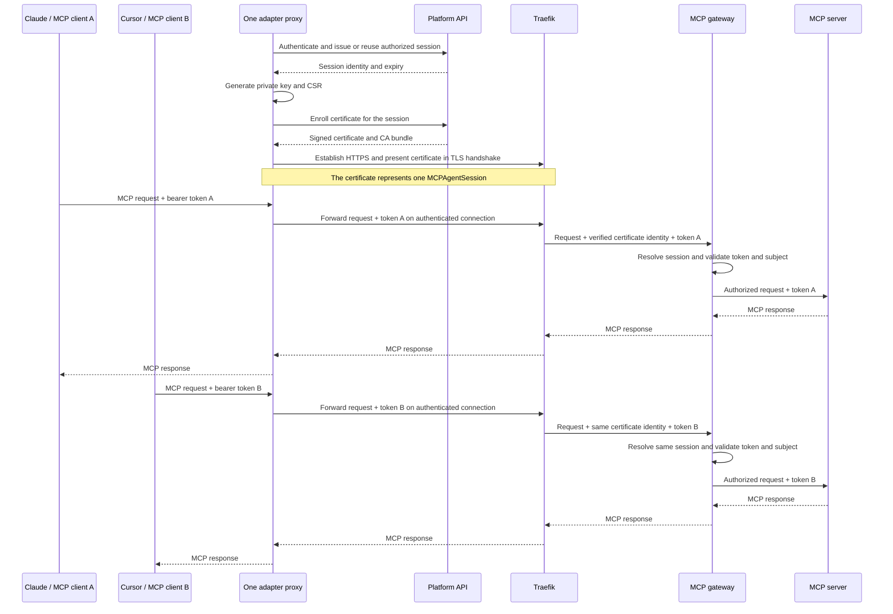

# Agent HTTP Adapter

Use `mcp-runtime adapter proxy` to connect Claude Desktop, Cursor, or another
MCP client to a server on your platform. It runs beside the client: the client
connects to a local URL, and the adapter forwards requests to the platform over
HTTPS.

The adapter gets a certificate for the agent's session and keeps it refreshed.
On an installation configured to verify these certificates, the gateway uses
it to identify the human, agent, team, and session making a tool call. If the
server also requires OAuth, the client must send its bearer token; the adapter
forwards it on each request. The token's user must match the session's user,
and any team claim must match the session. The gateway does not trust identity
headers supplied by the client.

Use an active managed agent from the team's agent directory. List agents with
`mcp-runtime agent list <team-slug> --status active`; a team owner or platform
admin can create one with `mcp-runtime agent create <team-slug> --name <name>`.
Members see only agents covered by an applicable grant or their own active
session, so ask a team owner for an ID if the list is empty. Use the immutable
`agt_...` ID returned by the directory in the grant and adapter commands below.
A display name such as `Cursor` is not an agent ID.

## Required grant

Create an enabled `MCPAccessGrant` before starting the adapter. The grant must
match the target server and agent. The platform refuses session and certificate
issuance when no grant matches.

```yaml
apiVersion: mcpruntime.org/v1alpha1
kind: MCPAccessGrant
metadata:
  name: triage-grant
  namespace: mcp-team-acme
spec:
  serverRef:
    name: workspace-assistant
  subject:
    agentID: agt_01arz3ndektsv4rrffq69g5fav # replace with your active agent ID
  maxTrust: high
  allowedSideEffects: [read]
  policyVersion: v1
  toolRules:
    - name: add
      decision: allow
```

## In-memory enrollment

Log in, then start the proxy with the server and agent identifiers:

```bash
mcp-runtime auth login --api-url https://platform.example.com

mcp-runtime adapter proxy \
  --runtime-url https://mcp.example.com/workspace-assistant/mcp \
  --server workspace-assistant \
  --namespace mcp-team-acme \
  --agent agt_01arz3ndektsv4rrffq69g5fav \
  --auto-refresh
```

For an OAuth-enabled target, the local MCP client normally completes OAuth and
sends `Authorization` to the adapter. The proxy preserves it for each request.
For a client that cannot attach the header, set `--auth-header "Bearer
<access-token>"`; this static value is used for every request. Omit it when the
target has no OAuth configuration or when clients need to send different
tokens.

The adapter:

1. Requests an `MCPAgentSession` that is authorized by the matching grant.
2. Generates the private key and CSR locally.
3. Sends the CSR to the platform certificate endpoint.
4. Receives the signed leaf certificate and CA bundle.
5. Presents the certificate during the HTTPS handshake and forwards each
   request's OAuth bearer when the target requires one.
6. Renews the certificate before it expires when `--auto-refresh` is enabled.

The private key never leaves the adapter process.

### Certificate identity and OAuth tokens

The adapter certificate identifies one `MCPAgentSession`; it does not identify
an individual MCP protocol session or contain an OAuth token. The certificate
is presented during the HTTPS handshake. The local MCP client sends its OAuth
bearer on each HTTP request, and the proxy forwards that request's
`Authorization` header over the authenticated connection. The gateway checks
the certificate identity and, when OAuth is enabled, requires the token subject
to match the session's human and any team claim to match the session's team.



This works when both OAuth tokens are valid for the target MCP resource and
identify the same human as the certificate-bound session. A token for another
human is rejected. Both clients' calls are attributed to the same Runtime
agent and session. If clients need distinct Runtime agent identities or
session-level audit attribution, run a separate adapter proxy with its own
certificate for each identity.

The default listener is `127.0.0.1:8099` and does not authenticate local
clients. Any process that can connect to it can make calls using that adapter
session. Keep it on loopback and share it only among clients intended to act as
the same Runtime agent and human.

Do not set `--auth-header` when clients need different OAuth tokens. It is a
static override applied to every outbound request, so it replaces each
client's per-request bearer. Let each client send its own `Authorization`
header instead. `--auto-refresh` refreshes the adapter certificate; each MCP
client remains responsible for obtaining and refreshing its OAuth token.

## Save a certificate

Use `adapter enroll` when another process manages the proxy lifecycle:

```bash
mcp-runtime adapter enroll \
  --server workspace-assistant \
  --namespace mcp-team-acme \
  --agent agt_01arz3ndektsv4rrffq69g5fav
```

The command saves credentials below
`$MCP_RUNTIME_CONFIG_DIR/certs/<scope>`; the default root is
`~/.mcpruntime/certs`. The scope is deterministic for the platform, namespace,
server, agent, and SPIFFE identity. The command prints the exact directory.

- `client.key` is the locally generated private key, mode `0600`.
- `client.crt` is the session-bound leaf certificate, mode `0600`.
- `ca.crt` is the CA bundle used to verify the runtime TLS certificate.

Start the proxy with the saved files:

```bash
mcp-runtime adapter proxy \
  --runtime-url https://mcp.example.com/workspace-assistant/mcp \
  --tls-client-cert ~/.mcpruntime/certs/<scope>/client.crt \
  --tls-client-key ~/.mcpruntime/certs/<scope>/client.key \
  --tls-ca-bundle ~/.mcpruntime/certs/<scope>/ca.crt
```

For an OAuth-enabled target, the local MCP request must still carry
`Authorization`, or the proxy must be started with `--auth-header`. The
certificate files identify the enrolled Runtime session; the OAuth bearer is
still a separate per-request credential.

## CA bundle and CSR flow

The adapter creates a private key and a PKCS#10 CSR containing the expected
session SPIFFE URI. The platform validates the CSR against the issued
`MCPAgentSession`, signs it with the configured workload issuer, and returns:

- the signed client certificate;
- the CA certificate chain required to verify platform TLS certificates;
- the SPIFFE ID and expiry time.

The CA bundle does not receive or sign the CSR itself. The platform certificate
endpoint submits the validated request to the configured issuer and returns the
issuer's chain as the bundle.

## Configuration

| Environment variable | Purpose |
|---|---|
| `MCP_RUNTIME_URL` | Absolute HTTPS Streamable HTTP MCP route. |
| `MCP_RUNTIME_ADAPTER_SERVER` / `MCP_RUNTIME_ADAPTER_AGENT` | Server and agent for in-memory certificate enrollment. |
| `MCP_RUNTIME_ADAPTER_NAMESPACE` | Target namespace. |
| `MCP_RUNTIME_ADAPTER_AUTO_REFRESH` | Renew an in-memory certificate before expiry. |
| `MCP_PLATFORM_API_URL` | Platform API base URL. |
| `MCP_TRUST_DOMAIN` | Optional SPIFFE trust domain check. |
| `MCP_RUNTIME_TLS_CLIENT_CERT` / `_KEY` | Externally managed PEM client certificate and key. |
| `MCP_RUNTIME_TLS_CA_BUNDLE` | PEM CA bundle used to verify the runtime. |
| `MCP_RUNTIME_AUTH_HEADER` | Static OAuth `Authorization` override when the local MCP client does not send one; it does not set adapter identity and is used for every request. |
| `MCP_RUNTIME_HOST_HEADER` | Override the HTTP Host header for ingress routing. |
| `MCP_RUNTIME_LISTEN_ADDR` | Local proxy listener; defaults to `127.0.0.1:8099`. |
| `MCP_RUNTIME_REQUEST_TIMEOUT` | Timeout for adapter to runtime requests. |
| `MCP_RUNTIME_MAX_INBOUND_BYTES` | JSON-RPC request body limit; defaults to 16 MiB. |
| `MCP_RUNTIME_LOG_LEVEL` | `info` logs runtime denials to stderr. |

Non-HTTPS runtime URLs, missing certificates, invalid key pairs, and
certificate enrollment failures stop the adapter before it begins listening.
When the target enables OAuth, the gateway also rejects requests that lack a
bearer token or whose OAuth subject does not match the certificate's enrolled
session. When OAuth is omitted, the verified certificate alone authenticates
the adapter.

## Enterprise mTLS and SPIFFE

To authenticate adapters with session-bound client certificates, install
cert-manager and an internal `ClusterIssuer` backed by your company CA, Vault,
ADCS, or another workload PKI. Do not use Let's Encrypt for client certificates.

Local `setup --test-mode` installs cert-manager and provisions the bundled
`mcp-runtime-ca` ClusterIssuer automatically so this flow can be validated on
Kind without public DNS or a production CA.

```bash
mcp-runtime setup \
  --with-tls \
  --tls-cluster-issuer letsencrypt-prod \
  --mtls-cluster-issuer company-workload-ca
```

Adapter certificate authentication on **gateway** server routes is opt-in: set
`MCP_ADAPTER_CERTIFICATES=true` for setup (it passes it to the operator) in
addition to naming a workload issuer with `--mtls-cluster-issuer`. Enabling it
moves every gateway-enabled server that uses the Traefik ingress class from a
plain Ingress to a Traefik IngressRoute, and puts the gateway behind an mTLS hop
that only Traefik can reach; servers are then no longer reachable directly on
their Service. It requires `--with-tls` because Traefik terminates client TLS;
the IngressRoute uses the operator's configured ingress entrypoints (`websecure`
when none are set). `--tls-cluster-issuer` controls public ingress and registry
certificates and is separate from the workload issuer. Set `MCP_TRUST_DOMAIN` to
the platform's SPIFFE trust domain. Production must configure both
`MCP_TRUST_DOMAIN` and `MCP_SETUP_MTLS_CLUSTER_ISSUER`; test mode defaults the
issuer to `mcp-runtime-ca`.

**Approval gate.** The runtime API creates the session certificate as a
cert-manager `CertificateRequest` against the workload issuer, and cert-manager
auto-approves requests to built-in issuers by default. Any other principal able
to create a `CertificateRequest` for that issuer could therefore obtain a
certificate with a forged SPIFFE URI outside the runtime API's session checks.
Outside `--test-mode`, setup refuses `MCP_ADAPTER_CERTIFICATES=true` unless
`MCP_WORKLOAD_ISSUER_APPROVAL_ACK=true` asserts that an effective approver gates
the issuer (Staging E2E sets this for its disposable VM). Installing the
approver-policy CRD alone does not establish a policy or disable cert-manager's
default auto-approver; either condition can leave forged requests approvable.
Before acknowledging the gate, verify that the policy allows only the runtime
API service account, `digital signature` +
`client auth` usages, and the `spiffe://<trust-domain>/ns/<ns>/session/<name>`
URI shape, and the default approver should be disabled for this issuer only after
that policy is tested (keep public and internal TLS issuance working, and roll
back by re-enabling the default approver). The runtime API also rejects any
issued certificate whose URI, key, usages, or lifetime differ from the submitted
CSR, and its ClusterRole only grants `create` and `get` on `CertificateRequests`.

OAuth is independent. Omit `spec.auth` for a cert-only governed route; add
`spec.auth` only when direct clients (or adapters calling an OAuth-enabled
target) need a bearer. Do not apply empty `auth: {}` unless you intend to turn
OAuth on via the derived issuer.

```yaml
# Cert-only (adapters present the session certificate; no bearer required)
spec:
  ingressHost: mcp.mcpruntime.org
  publicPathPrefix: workspace-assistant
  ingressClass: traefik
  gateway:
    enabled: true
  # omit auth

# Optional OAuth on the same certificate-capable route
spec:
  ingressHost: mcp.mcpruntime.org
  publicPathPrefix: workspace-assistant
  ingressClass: traefik
  gateway:
    enabled: true
  auth:
    mode: oauth
    issuerURL: https://auth.mcpruntime.org
    audience: https://mcp.mcpruntime.org/workspace-assistant/mcp
```

**How termination works.** Traefik verifies a presented adapter client
certificate against the platform workload CA, asserts the verified SPIFFE
identity to the gateway, and re-encrypts over a second mTLS hop. Client-supplied
`X-MCP-*` identity headers are not trusted. Ordinary OAuth clients without a
client certificate continue with Bearer only on OAuth-enabled servers. The
operator generates the Traefik `TLSOption` (`VerifyClientCertIfGiven`), the
`spiffe-identity` middleware, a `ServersTransport` (re-encrypted hop with a
pinned ingress certificate), and a path-based `IngressRoute`. A
`NetworkPolicy` restricts the gateway port to the ingress so the SPIFFE
assertion cannot be forged by another pod, and the gateway requires a
verified mTLS hop before trusting that assertion.

The caller-facing server certificate for the route is published as Traefik's
**default certificate** via a single `TLSStore` named `default`, not a
per-IngressRoute `secretName` (Traefik resolves `secretName` only in the
IngressRoute's own tenant namespace, where the shared platform host certificate
does not exist). Configure the operator with `MCP_DEFAULT_INGRESS_TLS_SECRET`
(the host certificate Secret) and `MCP_DEFAULT_INGRESS_TLS_SECRET_NAMESPACE` (a
Traefik-watched namespace holding that Secret); the operator then reconciles the
one `default` TLSStore there. When unset, Traefik falls back to its built-in
default certificate.

**Kind contributor cluster.** Adapter-certificate IngressRoutes are
websecure-only. Port-forward both Traefik ports and probe HTTPS with an
insecure TLS skip for the local default cert:

```bash
kubectl port-forward -n traefik svc/traefik 18080:8000 18443:8443
# Platform / plain Ingress samples: http://127.0.0.1:18080/...
# Adapter-certificate MCP routes: https://127.0.0.1:18443/<publicPathPrefix>/mcp
```

Enroll an external adapter after signing in to the platform:

```bash
mcp-runtime adapter enroll \
  --platform-url https://platform.mcpruntime.org \
  --server workspace-assistant \
  --namespace mcp-team-acme \
  --agent agt_01arz3ndektsv4rrffq69g5fav \
  --trust-domain mcpruntime.org
```

The command generates `client.key` locally and submits only a CSR. The platform
checks that the SPIFFE URI identifies a session owned by the signed-in
principal, then returns short-lived `client.crt` and `ca.crt` under
`MCP_RUNTIME_CONFIG_DIR/certs` (normally `~/.mcpruntime/certs`).
`--platform-url` takes scheme and host with no `/api` path, and defaults to the
URL saved by `auth login` or `$MCP_PLATFORM_API_URL`. Because enrollment is
session-bound, the grant prerequisite above applies here too.

```bash
mcp-runtime adapter proxy \
  --runtime-url https://mcp.mcpruntime.org/workspace-assistant/mcp \
  --tls-client-cert ~/.mcpruntime/certs/<scope>/client.crt \
  --tls-client-key ~/.mcpruntime/certs/<scope>/client.key \
  --tls-ca-bundle ~/.mcpruntime/certs/<scope>/ca.crt
```

### One-command mode

Pass `--server` and `--agent` to `adapter proxy` so it enrolls a session-bound
certificate in memory at startup (nothing is written to disk) and feeds it
straight to the runtime transport:

```bash
mcp-runtime adapter proxy \
  --runtime-url https://mcp.mcpruntime.org/workspace-assistant/mcp \
  --platform-url https://platform.mcpruntime.org \
  --server workspace-assistant \
  --namespace mcp-team-acme \
  --agent agt_01arz3ndektsv4rrffq69g5fav \
  --trust-domain mcpruntime.org \
  --auto-refresh
```

In-memory enrollment requires an `https` `--runtime-url` and the same
`--server`/`--agent` inputs as `enroll` (the certificate's SPIFFE URI encodes
the issued session). With `--auto-refresh`, the adapter enrolls a replacement
certificate before the current certificate expires and drains idle
connections so subsequent requests renegotiate with it. Long-running adapters
keep working without restarts. To reuse `enroll` output instead of in-memory
enrollment, pass the `--tls-client-cert`/`-key`/`-ca-bundle` files.

Adapters authenticate with the session-bound certificate; grant and session
policy authorize that identity. On OAuth-enabled targets they also forward the
bearer and the gateway binds the certificate session human to the OAuth
subject. Existing MCPServer resources using the removed `auth.mode: mtls` must
omit `spec.auth` for cert-only routes or set `auth.mode: oauth` with
`issuerURL` and `audience` when OAuth is required. Set platform-wide
`MCP_TRUST_DOMAIN` and `MCP_MTLS_CLUSTER_ISSUER` to enable adapter enrollment;
test-mode defaults the issuer to `mcp-runtime-ca`.

The gateway derives adapter governance identity from the verified SPIFFE URI
and the operator-rendered session binding.

## Next steps

Verify an allowed and a denied tool call, then inspect the gateway decisions in
[Services and Observability](platform-services.md). For identity or policy
failures, use [Troubleshooting](troubleshooting.md) and
[Identity and Authorization](identity-and-authorization.md).

For a server requiring OAuth, follow [MCP OAuth](mcp-oauth.md) for token and
resource configuration. Return to [Server and Client Guides](usage-overview.md)
for the complete publishing and access flow.
