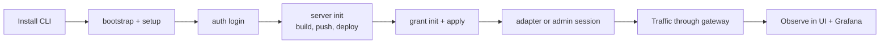

# Platform Installation

<span id="self-hosting-mcp-runtime"></span>

Install MCP Runtime on a Kubernetes cluster in your cloud or on-premises
environment. To try user and team workflows first, use the
[public platform walkthrough](hosted-quickstart.md).

## Choose your path

- **Try the public reference platform:** follow the [walkthrough](hosted-quickstart.md); no cluster is required.
- **Self-host on an existing cluster:** install the CLI, check cluster readiness,
  then follow the production-style setup below.
- **Contribute on local Kind:** use the [Development and Testing](contributor/README.md)
  and [Local Kind and Test Mode](contributor/local-kind.md).

To adapt the project's complete infrastructure example, use
[Cluster Provisioning](cluster-provisioning.md) and
[Public Reference Deployment](reference-deployment.md). The reference chooses K3s
for Kubernetes and Docker/Caddy for a separate Keycloak VM. Select your
distribution and identity provider before adopting its configuration.

## Prerequisites

For a release CLI install, you need `curl` or `wget` on macOS/Linux, or
PowerShell on Windows. Go and Make are only needed when building from source.

To install the platform, you also need:

- Docker or a Docker-compatible client, with the daemon running and reachable
- `kubectl` on `PATH`, configured for the intended target cluster
- A running Kubernetes cluster with DNS, storage, and ingress prepared.
  Start with [Deployment Options](deployment-targets.md), then
  [Cluster Requirements](cluster-readiness.md).

Contributor and example workflows also use Go `1.26+`, Make, `curl`, `jq`,
Python 3, and Kind for local test-mode clusters. Run the repository's dependency
checks from a source checkout:

```bash
make deps-install              # best-effort install for supported macOS/Linux hosts
STRICT_DEPS_CHECK=1 make deps-check
```

These checks cannot start Docker Desktop, create cloud credentials, or configure
your kubeconfig. The [Development and Testing](contributor/README.md) owns source
checkout and local cluster setup.

## 1. Install the CLI

**Option A: install a release binary** (no Go required). Select your operating
system and copy the install command:

=== "macOS"

    ```bash
    curl -fsSL https://raw.githubusercontent.com/mcp-runtime/mcp-runtime/main/install.sh | MCP_RUNTIME_OS=darwin sh
    ```

=== "Linux"

    ```bash
    curl -fsSL https://raw.githubusercontent.com/mcp-runtime/mcp-runtime/main/install.sh | MCP_RUNTIME_OS=linux sh
    ```

=== "Windows (amd64)"

    ```powershell
    irm https://raw.githubusercontent.com/mcp-runtime/mcp-runtime/main/install.ps1 | iex
    ```

The macOS/Linux installer detects the CPU and installs to `~/.local/bin`
without `sudo`. Windows installs to a user-local directory and adds it to your
user `PATH`; open a new terminal after installation. Pin a
specific release by setting `MCP_RUNTIME_VERSION` to its tag before running the
installer. For example, run `export MCP_RUNTIME_VERSION=vX.Y.Z` on macOS/Linux
or `$env:MCP_RUNTIME_VERSION='vX.Y.Z'` in PowerShell.

The macOS/Linux installer logs detection, download, and installation steps,
shows download progress, and retries failed transfers. Color is automatic in a
terminal; set `NO_COLOR=1` to disable it.

Browse all binaries on the
[latest GitHub release](https://github.com/mcp-runtime/mcp-runtime/releases/latest).
If macOS or Linux cannot find `mcp-runtime`, add `~/.local/bin` to your shell's
`PATH`, for example with `export PATH="$HOME/.local/bin:$PATH"`.

**Option B: build from source** (requires Go 1.26+):

```bash
make deps
make build
```

This produces `./bin/mcp-runtime` with version metadata from
`git describe --tags --match 'v*'`, the current commit, and UTC build time.
For source builds, add the checkout’s `bin` directory to `PATH` with
`export PATH="$PWD/bin:$PATH"` to run the commands below.
Release binaries use the release tag exactly. Override with
`VERSION=<tag> make build` when needed.

## 2. Confirm cluster readiness

```bash
mcp-runtime bootstrap
```

Before setup, confirm the target Kubernetes cluster is ready for registry
pushes, image pulls, ingress, storage, and TLS. See
[Deployment Options](deployment-targets.md) to choose the right install shape
for self-managed or managed Kubernetes, then
[cluster-readiness.md](cluster-readiness.md) for distribution-specific
preparation.

`setup` installs MCP Runtime resources into an already-running cluster. It does
not configure node DNS, containerd or Docker registry trust, public DNS, TLS
issuers, image pull credentials, or storage classes. Fix those prerequisites
with your platform tooling before continuing.

`bootstrap` validates kubectl connectivity, CoreDNS, the default
`StorageClass`, Traefik `IngressClass`, and MetalLB namespace. It only warns;
fix gaps with your platform tooling, or `bootstrap --apply --provider k3s` to
install bundled CoreDNS / local-path on k3s. After setup, run `cluster diagnostics`
to validate the installed MCP Runtime resources, registry pulls, ingress,
Sentinel, and operator readiness.

## 3. Choose production-style setup { #4-production-style-install }

Use this path for any cluster you intend to keep.
That includes staging, internal shared clusters, externally reachable installs,
or anything that needs stable registry, DNS, TLS, storage, and ingress
ownership.

Before `setup`, make these decisions explicitly:

- Registry: bundled registry with TLS, or a provisioned external registry
- DNS: stable hostnames for `registry`, `mcp`, and `platform`
- TLS: Let's Encrypt, enterprise `ClusterIssuer`, or preinstalled cert flow
- Ingress: repo-managed Traefik or an existing platform ingress controller
- Storage and retention: registry and Sentinel persistence choices
- Image pull auth: pull secrets, workload identity, or node-native registry auth

Read these first:

- [Deployment Options](deployment-targets.md)
- [Cluster Requirements](cluster-readiness.md)
- [Platform service Kubernetes awareness and hardening](platform-services.md#kubernetes-awareness-and-hardening)
- [Multi-team isolation](teams-and-access.md) if multiple teams will publish or govern servers on one cluster

For production-oriented setup, choose the registry path explicitly. With a
provisioned registry:

```bash
mcp-runtime bootstrap
mcp-runtime setup --registry-mode external --external-registry-url registry.example.com --with-tls --strict-prod
```

With the bundled registry serving internal HTTPS, setup generates an internal
CA secret for the registry pod certificate unless you provide an existing
ClusterIssuer. Configure every node to trust that CA for image pulls. Public
ingress TLS can still use ACME:

```bash
mcp-runtime bootstrap
mcp-runtime setup --registry-mode bundled-https --with-tls --acme-email ops@example.com --strict-prod
```

If you want hostnames derived from one domain, set:

```bash
export MCP_PLATFORM_DOMAIN=example.com
export MCP_PLATFORM_ADMIN_EMAIL=admin@example.com
mcp-runtime setup --registry-mode external --external-registry-url registry.example.com --with-tls --strict-prod
```

That derives:

- `registry.example.com`
- `mcp.example.com`
- `platform.example.com`

If you already have an external registry, provision it before setup so the
cluster pulls from the same hardened image host you intend to keep:

```bash
mcp-runtime registry provision --url registry.example.com
mcp-runtime setup --registry-mode external --with-tls --strict-prod
```

For public/TLS setup, setup validates the host env even without
`--strict-prod`. Use `MCP_PLATFORM_DOMAIN` or set
`MCP_PLATFORM_INGRESS_HOST`, `MCP_REGISTRY_INGRESS_HOST`, and
`MCP_MCP_INGRESS_HOST` explicitly. For bundled HTTPS with a public domain,
set `MCP_REGISTRY_ENDPOINT=registry.<domain>` so kubelet pulls match the TLS
certificate (not the registry ClusterIP). Set `MCP_PLATFORM_ADMIN_EMAIL` or
`ADMIN_USERS` so the first OIDC login for that email is promoted to platform
admin; `--acme-email` is only the certificate contact email.

When building setup images from a machine with a different CPU architecture
than the cluster, set `MCP_IMAGE_PLATFORM` to the target node platform, for
example `MCP_IMAGE_PLATFORM=linux/amd64` for standard VPS/k3s nodes.

Tenant users open server-scoped Prometheus and Grafana views from Activity
server rows. The platform API verifies access to the exact `MCPServer` and
expands only allowlisted Prometheus queries; raw Prometheus remains internal.
The bundled Prometheus discovers operator-managed MCPServer Services and
scrapes metrics from their gateway sidecars.

You can also skip the saved provision step and pass
`--external-registry-url registry.example.com` directly to `setup`.

If you use an internal CA instead of ACME, install the issuer first and point
setup at it:

```bash
mcp-runtime setup --with-tls --tls-cluster-issuer <issuer-name> --strict-prod
```

What `--strict-prod` is for:

- requires TLS
- rejects dev-only registry assumptions such as `registry.local`
- forces you onto a stable production-style registry endpoint

Do not use the contributor `--test-mode` flow as a production install guide.
`--test-mode` is for local development and CI-like validation; it provisions a
local cert-manager workload CA for mTLS tests and still builds
and pushes local images and assumes the contributor registry and ingress shape.

### Enterprise-provided TLS certificate files

Use this mode when enterprise IT supplies a certificate chain (`fullchain.pem`)
and its matching private key (`privkey.pem`) but does **not** operate a
cert-manager `ClusterIssuer`. Unlike `--tls-cluster-issuer`, this mode only
references the Secrets below. Runtime never creates or renews a cert-manager
`Certificate`.

Set `INSTALL_KUBECONFIG` to the kubeconfig for your installation cluster.
The target namespaces must already exist when importing their Secrets.

Verify that the certificate SANs cover every public Runtime hostname, and keep
the PEM files outside the repository and shell history. Kubernetes Secrets are
namespace-scoped, so import the pair once for each Runtime ingress namespace:

```bash
kubectl --kubeconfig "$INSTALL_KUBECONFIG" -n registry create secret tls registry-tls \
  --cert=/secure/fullchain.pem --key=/secure/privkey.pem \
  --dry-run=client -o yaml | kubectl --kubeconfig "$INSTALL_KUBECONFIG" apply -f -

kubectl --kubeconfig "$INSTALL_KUBECONFIG" -n mcp-platform create secret tls mcp-platform-tls \
  --cert=/secure/fullchain.pem --key=/secure/privkey.pem \
  --dry-run=client -o yaml | kubectl --kubeconfig "$INSTALL_KUBECONFIG" apply -f -
```

Then run setup with static Secret mode:

```bash
mcp-runtime setup --kubeconfig "$INSTALL_KUBECONFIG" --with-tls --provided-tls-secrets --strict-prod
```

Do not combine `--provided-tls-secrets` with `--acme-email` or
`--tls-cluster-issuer`. If you also deploy bundled mcp-auth, add its
operator-managed TLS Secret to the `mcp-platform` namespace and pass its name
through the optional `--mcp-auth-tls-secret` override.

#### Renewal

You renew certificates in this mode. Before the enterprise certificate
expires, IT supplies a replacement matching pair; rerun the two `kubectl create
secret tls ... --dry-run=client -o yaml | kubectl --kubeconfig "$INSTALL_KUBECONFIG" apply -f -` commands above.
Traefik observes Secret updates and serves the replacement certificate. Verify
the public endpoint's hostname and expiry after each rotation.

## 4. Configure and install the platform stack { #5-install-the-platform-stack }

Run the `setup` command selected in step 3 with any additional configuration
below. The examples are alternatives; do not rerun bare `setup` after your
configured install.

`setup` installs the platform pieces companies need for MCP operations: CRDs,
`mcp-runtime` and catalog namespaces, the internal Docker registry, ingress
wiring, the operator, and the bundled Sentinel stack for gateway policy,
analytics, audit, and observability.

`--platform-mode` chooses who can browse and publish servers on your
installation. In `public` mode, visitors can browse its public catalog without
signing in. This setting applies to your installation; it does not connect it
to `platform.mcpruntime.org`.

| Mode | Default namespace behavior | Behavior |
|---|---|---|
| `tenant` | Principal team namespace | Default private mode. Signed-in users publish through team namespaces for teams they belong to. |
| `org` | `mcp-servers-org` | Signed-in users publish and browse the org-wide catalog and can still work in team namespaces. |
| `public` | `mcp-servers-public` | Anonymous users can browse the public preview catalog; signed-in users publish public preview MCP servers and can still work in team namespaces. |

For browser Google sign-in, provide the OAuth client ID before setup. Non-test
public TLS installs (`--platform-mode public --with-tls`) fail fast unless
`GOOGLE_CLIENT_ID` / `MCP_GOOGLE_CLIENT_ID` is set, or `OIDC_ISSUER`,
`OIDC_AUDIENCE`, and `OIDC_JWKS_URL` are all set for another provider. For
Google, setup uses the client ID as the OIDC audience and fills the standard
Google issuer and JWKS URL when those values are not set explicitly:

```bash
export GOOGLE_CLIENT_ID=<client>.apps.googleusercontent.com
export MCP_PLATFORM_ADMIN_EMAIL=admin@example.com
mcp-runtime setup --with-tls --platform-mode public
```

For a non-Google OIDC provider, set `OIDC_ISSUER`, `OIDC_AUDIENCE`, and
`OIDC_JWKS_URL` before setup. Reruns preserve existing values in
`mcp-platform/mcp-shared-config` and `mcp-observability/mcp-shared-config`.

For multi-team or tenant-separated deployments, keep setup as the platform
install and provision one namespace per team with `mcp-runtime team create
<slug>` (platform API). Use the platform API to default team IDs, or set
`spec.teamID` and `subject.teamID` directly in YAML; an explicit foreign
`subject.teamID` delegates access to another team while the gateway still
matches every non-empty subject field. See
[Multi-team isolation](teams-and-access.md).

Common variants:

```bash
mcp-runtime setup --with-tls            # cert-manager TLS for the registry
mcp-runtime setup --platform-mode public # public preview catalog namespace
mcp-runtime setup --without-sentinel    # skip the request-path stack
mcp-runtime setup --test-mode           # local Kind/dev build+push path
mcp-runtime setup --storage-mode hostpath # single-node cluster with no dynamic provisioner
mcp-runtime setup --parallel-builds     # build and publish setup images in parallel
```

Defaults if you pass nothing: `--ingress traefik`, `--ingress-manifest
config/ingress/overlays/http`, `--registry-mode auto`, `--registry-type docker`,
`--registry-storage 20Gi`, `--platform-mode tenant`, and `--storage-mode
dynamic`. `--parallel-builds` changes image build and publish only; cluster,
registry, TLS, and rollout sequencing stay the same.

To enable optional adapter client certificates on gateway server routes, add
`--mtls-cluster-issuer <cluster-issuer>` alongside `--with-tls`. Name an
enterprise cert-manager issuer. In test mode, setup provisions the bundled
`mcp-runtime-ca` by default; outside test mode, that CA must already exist and
pass setup validation. Production certificate issuance also requires an
approval policy; see the linked adapter guide. Set
`MCP_ADAPTER_CERTIFICATES=true` to turn the feature on; production must also
set `MCP_TRUST_DOMAIN` (for example `mcpruntime.org`). OAuth remains optional:
omit `spec.auth` for cert-only routes, or add `spec.auth` when direct clients
need a bearer. See
[Agent Adapters](connect-clients.md#enterprise-mtls-and-spiffe).

The bundled mcp-auth authorization server is optional and off by default. Check
the provider with `mcp-runtime auth provider-check --issuer-url <issuer>`,
then enable it with `--with-mcp-auth-server`; outside test mode it also needs
`--mcp-auth-signing-key-secret`. The issuer defaults to
`https://auth.<MCP_PLATFORM_DOMAIN>/mcp-auth`, and the operator reconciles
resource audiences from OAuth MCPServers. With managed TLS, setup provisions the auth
issuer certificate automatically; `--mcp-auth-tls-secret` is only an optional
override for externally managed certificates. See
[MCP authorization](mcp-oauth.md).

Every setup flag and its default is listed in the
[CLI reference](cli-reference.md#setup).

### Local development notes

For Kind or other local setups where traffic reaches Traefik through `kubectl port-forward` or a NodePort but the ingress controller does not publish `Ingress.status.loadBalancer.ingress[]`, run setup with permissive ingress readiness:

```bash
export MCP_INGRESS_READINESS_MODE=permissive
mcp-runtime setup --test-mode --ingress-manifest config/ingress/overlays/http
kubectl port-forward -n traefik svc/traefik 18080:8000 18443:8443
```

Then use `http://127.0.0.1:18080/<publicPathPrefix>/mcp` for plain Ingress MCP
traffic. When `MCP_ADAPTER_CERTIFICATES=true`, gateway routes use Traefik
IngressRoute on `websecure` only — probe them at
`https://127.0.0.1:18443/<publicPathPrefix>/mcp` (local Kind typically needs
`-k` / insecure TLS skip for Traefik's default certificate).

!!! warning "`MCPServer` stuck in `PartiallyReady` while traffic works"
    Strict readiness (the default) waits for the Ingress to publish
    `status.loadBalancer.ingress[]`. Many dev and NodePort-style controllers route
    traffic without ever publishing it. `permissive` treats an Ingress with rules as
    ready. Keep `strict` for production clusters that rely on published
    load-balancer status.

## 5. Confirm health { #6-confirm-health }

After `mcp-runtime auth login --api-url <platform-url>`, use `status` for a quick
authenticated platform API check. Use the other status commands for cluster,
registry, and workload health.

```bash
mcp-runtime status
mcp-runtime cluster status
mcp-runtime registry status
mcp-runtime sentinel status
```

## 6. Deploy your first server { #7-deploy-your-first-server }

The server deploy flow (init → validate → build → push → deploy → grant → adapter)
is covered step-by-step in the learning modules:

- [Module 2: Your first governed server](learn/02-first-governed-server.md): end-to-end hands-on
- [Module 3: Multi-team setup](learn/03-multi-team-access.md): two teams, cross-team grants

Quick reference:

```bash
mcp-runtime auth login --api-url <platform-url>
mcp-runtime server init my-server --from-server http://localhost:8088
mcp-runtime server validate --metadata-dir .mcp
mcp-runtime server build image my-server --tag v1
mcp-runtime server push --image ... --scope tenant
mcp-runtime server deploy my-server --scope tenant --metadata-dir .mcp
```

## 7. Observe live traffic and policy { #8-observe-live-traffic-and-policy }

Use the platform dashboard and API first:

```bash
mcp-runtime auth login --api-url <platform-url>
mcp-runtime status
# Dashboard: http://localhost:18080/ (Kind) or https://platform.<domain>/
```

Admin/operator kubectl diagnostics (`sentinel *` requires admin cluster access):

```bash
mcp-runtime sentinel port-forward ui          # Governance + dashboard
mcp-runtime sentinel port-forward grafana     # Metrics + traces + logs
mcp-runtime sentinel logs gateway --follow    # Tail the proxy
```

## Local alternative: contributor test-mode cluster (Kind) { #3-contributor-test-mode-cluster-local-kind }

For local development, CI, or contributing to the repo, use the Kind-based
test-mode path. The contributor docs own this path completely:

- [Development and Testing](contributor/README.md)
- [Local Kind and Test Mode](contributor/local-kind.md)

Quick path (requires `kind` on `PATH`; the linked guide creates an isolated
test kubeconfig so this does not use the ambient or production context):

```bash
make deps && make build
export PATH="$PWD/bin:$PATH"
# Follow Local Kind and Test Mode to create/export the test kubeconfig first.
export KUBECONFIG="$HOME/.kube/test-mcp-runtime-config"
mcp-runtime bootstrap
mcp-runtime cluster doctor
mcp-runtime setup --test-mode --ingress-manifest config/ingress/overlays/http
kubectl port-forward -n traefik svc/traefik 18080:8000 18443:8443
mcp-runtime cluster diagnostics
```

See [Local Kind and Test Mode](contributor/local-kind.md) for fresh-device and
existing-cluster instructions, including the isolated kubeconfig setup.

`bootstrap` and `cluster doctor` run before setup: `bootstrap` reports (and on
k3s can install) missing cluster prerequisites, `cluster doctor` checks nodes,
storage, ingress, DNS, and TLS readiness. `cluster diagnostics` runs after setup
to validate what was installed.

Local surfaces: platform `http://localhost:18080/`, plain Ingress MCP
`http://localhost:18080/<server-name>/mcp`, adapter-certificate MCP
`https://localhost:18443/<server-name>/mcp` (use `-k` for the local default
cert when `MCP_ADAPTER_CERTIFICATES=true`).

## End-to-end flow



## Next steps

- [Publish an MCP Server](publish-mcp-server.md): write manifests or `.mcp` metadata, build, push, deploy, and verify.
- [Multi-team isolation](teams-and-access.md): team IDs, namespaces, RBAC, and ingress guidance.
- [Architecture](architecture.md): how the pieces fit together.
- [CLI](cli-reference.md): full command reference.
- [API](api-reference.md): every CRD field and HTTP endpoint.
- [Platform services](platform-services.md): request-path governance, audit, observability.

For background on grants, sessions, trust, and side effects, see [Concepts](core-concepts.md).
