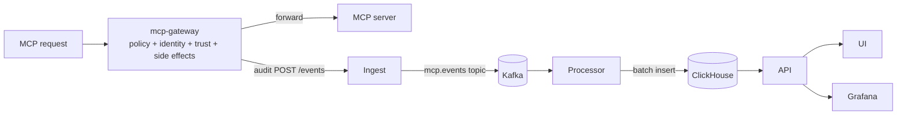

# Sentinel

`mcp-sentinel` is the bundled service stack for gateway enforcement, audit, query, governance UI, and observability for MCP servers. It governs **live MCP requests** only. It ships in `services/` and is installed by default with `mcp-runtime setup` (skip with `--without-sentinel`).

## Services

| Service | Role |
|---|---|
| **mcp-gateway** | Transparent sidecar. Extracts identity, evaluates tool-level policy, emits allow/deny audit events, forwards traffic upstream. |
| **mcp-auth-server (opt-in)** | Bundled OAuth authorization server. Setup deploys it only with `--with-mcp-auth-server`. It issues tokens; governance stays in `mcp-gateway`. |
| **ingest** | Receives `POST /events`, validates ingest-scoped API keys or optional JWTs, writes to Kafka. |
| **processor** | Consumes Kafka, batches, writes into ClickHouse with indexed audit fields. |
| **api** | Three HTTP services behind Traefik path routing: **platform-api** (Postgres identity/auth/registry), **runtime-api** (Kubernetes runtime governance + registry push), **analytics-api** (ClickHouse events/stats/usage). OpenAPI at `GET /api/v1/openapi.yaml` per service. |
| **ui** | Control-plane dashboard: user MCP server dashboard, MCP server catalog and connect config, user API keys, analytics dashboard, governance, MCP operations, and platform management. |
| **gateway** | The Traefik ingress Deployment in front of the API, ingest, and UI. It is cluster ingress and makes no policy decisions. Per-server enforcement happens in `mcp-gateway`. |
| **Go OAuth sample** | Sample MCP server in `examples/oauth-example-go-2025-11-25`; gateway-enabled resource name is `oauth-example-go-2025-11-25-gateway`. |

## Kubernetes awareness and hardening

Sentinel services run as Kubernetes workloads, but only some call the
Kubernetes API. For hardening, separate **Kubernetes-aware** services that hold
a service account token and RBAC from **Kubernetes-agnostic** services that only
use HTTP, Kafka, ClickHouse, Postgres, or local files.

| Component | Kubernetes awareness | Runtime access | Hardening notes |
|---|---|---|---|
| **platform-api** | Postgres-backed; no Kubernetes client. | Identity, auth, registry forwardAuth, admin namespaces/audit, `/internal/*` for runtime-api and analytics-api. | `k8s/08-platform-api-rbac.yaml` grants only user-key secret access. |
| **runtime-api** | Kubernetes-aware via `pkg/k8sclient`. | MCPServer reconciliation helpers, grants/sessions, deployments, registry push (pod-local emptyDir + `POD_IP`). Broad ClusterRole in `k8s/08-runtime-api-rbac.yaml`. | Main privileged API for cluster mutations. NetworkPolicy egress to platform-api:8080 in `k8s/22-split-api-networkpolicy.yaml`. |
| **analytics-api** | ClickHouse-only; `automountServiceAccountToken: false`. | Events, stats, usage queries; resolves display names via platform-api `/internal/*`. | No Kubernetes RBAC. NetworkPolicy egress to platform-api:8080. |
| **gateway** | Kubernetes-aware Traefik ingress controller. | Watches Ingress, Service, Endpoint, Secret, and IngressClass resources for the namespaces it serves. The bundled Sentinel-local gateway watches `mcp-sentinel`; the shared ingress overlays watch `registry`, `mcp-sentinel`, `mcp-servers`, `mcp-servers-org`, and `mcp-servers-public`. | Keep watched namespaces explicit, avoid cluster-wide ingress watches unless required, keep Grafana admin-gated, do not expose Prometheus directly on public hosts, and keep redaction middleware limited to routes that need it. |
| **mcp-gateway** | Kubernetes-integrated but Kubernetes API-agnostic. It is injected into MCP server pods and reads operator-rendered policy from mounted files and env vars. | Does not need a Kubernetes client or service account token. It forwards MCP traffic to the local server container and emits audit events to ingest. | Keep `automountServiceAccountToken: false`, read-only policy mounts, `readOnlyRootFilesystem`, dropped capabilities, and non-root execution. Treat `ANALYTICS_API_KEY` as ingest-scoped, not an admin API key. |
| **ui** | Kubernetes API-agnostic. | Serves the browser UI and proxies allowlisted read-only `GET /api/ui/v1/*` dashboard paths to runtime-api (`RUNTIME_UPSTREAM`) or analytics-api (`ANALYTICS_UPSTREAM`) using the server-held UI session credential. Login still uses `API_UPSTREAM` against platform-api. All other `/api/v1/*` traffic stays on Traefik split-API ingress. | Keep it behind TLS for public hosts, retain the security headers in `services/ui`, set `UI_REQUIRE_HTTPS=false` only for deliberate non-TLS dev ingress, set `UI_FORCE_SECURE_COOKIE=true` when a TLS-terminating proxy does not send `X-Forwarded-Proto: https`, and do not grant it Kubernetes RBAC. Sessions are in memory by default (lost on restart, not shared across replicas, so keep `replicas: 1`). Set `UI_SESSION_STORE=postgres` with `UI_SESSION_DATABASE_URL` and `UI_SESSION_ENCRYPTION_KEY` (32+ characters, identical on every replica) to keep sessions in a shared `ui_sessions` table with AES-GCM encrypted payloads; sessions then survive restarts and work across replicas. Rotating the key forces re-login. The gateway is not covered, and the shipped manifests stay at one replica until that backend is validated in the cluster. |
| **ingest** | Kubernetes API-agnostic. | Authenticates `/events`, validates request size and event shape, and writes to Kafka. | Require `INGEST_API_KEYS` or OIDC for real deployments, use ingest-only keys, restrict network access to proxy/gateway callers, and keep the public `/ingest` route off production hosts unless intentionally exposed. |
| **processor** | Kubernetes API-agnostic. | Consumes Kafka and writes ClickHouse. It only exposes health and metrics. | Do not expose it through ingress. Restrict network access to Kafka, ClickHouse, metrics scraping, and tracing endpoints. |
| **storage and observability** | Mixed. ClickHouse, Kafka, Postgres, Grafana, Prometheus, Tempo, Loki, and the OTel collector are Kubernetes API-agnostic in the bundled manifests; Promtail is Kubernetes-aware so it can discover pod logs. | Data stores and dashboards back Sentinel audit, identity, metrics, traces, and logs. Promtail has pod read/watch RBAC. | Review persistence, retention, backups, and dashboard auth before production use. The generated platform-host observability route uses `sentinel-admin-auth@file`; provide equivalent auth if you replace repo-managed Traefik, and review Promtail's cluster log visibility before enabling it on multi-tenant clusters. |

In production, give Kubernetes API access only to **runtime-api**, ingress
controllers, the runtime operator, and log collectors that need it. For services
that do not call Kubernetes, disable service account token automounting and
isolate them with NetworkPolicies where the cluster supports them.

## Event path



1. **Gateway evaluates the request.** Authenticates optional OAuth or a verified adapter certificate, loads policy from the operator-rendered ConfigMap, and calls the shared `pkg/policy` evaluator for allow / deny at `tools/call` time. The evaluator checks both trust and the tool's declared side-effect class.
2. **Ingest receives the event** on `/events`, validates the shared `pkg/events` envelope, and writes into Kafka topic `mcp.events`.
3. **Processor batches to ClickHouse.** Reads Kafka envelopes and uses `pkg/clickhouse` storage helpers to write to the event table.
4. **API exposes query surfaces.** Recent events, stats, sources, types, and filtered audit views use `pkg/clickhouse` query helpers.
5. **Trace context follows the event path.** Gateway request spans propagate to
   ingest over HTTP, continue through Kafka headers, and resume in the
   processor. Processor traces include Kafka consume spans and per-event
   ClickHouse persistence spans so a request can be followed across the
   gateway, ingest, processor, and storage handoff in Tempo. Ingest also stores
   the active `trace_id` with each event so ClickHouse rows can be linked back
   to Tempo traces.
6. **UI + dashboards consume the data.** UI renders the stream; Grafana backed by Prometheus, plus Tempo, Loki, and Promtail, cover the broader observability path.

## Storage and observability

| Component | Role |
|---|---|
| **ClickHouse** | Stores the event stream with trace IDs plus materialized fields: server, namespace, team ID, cluster, human, agent, session, decision, tool name. |
| **Kafka KRaft cluster** | Three combined broker/controller nodes buffer ingest events for the processor. `mcp.events` has three partitions, replication factor three, `min.insync.replicas=2`, and ingest publishes with `acks=all`. |
| **Prometheus + Grafana** | Service metrics, scrape config, dashboards. Prometheus scrapes the platform APIs, ingest, processor, ClickHouse, gateway sidecars, and the telemetry collectors (OTel collector, Loki, Tempo, Promtail). Rules flag required targets that are absent or down and list workloads without metrics (`mcp:scrape_uninstrumented_workload:info`); gateways expose bounded `mcp_gateway_oauth_outcomes_total{outcome}`. The "Scrape Coverage" dashboard separates absent targets from healthy targets with zero traffic. |
| **OTel Collector + Tempo** | Distributed tracing pipeline. |
| **Loki + Promtail** | Log shipping and storage. |

The bundled tracing path uses W3C trace context and baggage propagation. For
batch writes, the processor emits `clickhouse.insert_event` spans under each
event trace and a `clickhouse.insert_batch` span for the batch operation. Batch
spans include Kafka topic, partition, first/last offset, and per-partition
offset ranges.

## Service HTTP reference

In local test mode, Traefik usually exposes the Sentinel HTTP services through
`http://localhost:18080/`. Inside the cluster, call the service DNS names
directly.

For the local build, push, and rollout loop while editing `services/`, see
[Iterate on one Sentinel service](contributor/service-iteration.md).

`api` accepts `API_KEYS`, with admin elevation only for keys also listed in
`ADMIN_API_KEYS`. `ingest` accepts ingest-scoped `INGEST_API_KEYS`, with legacy
fallback to `API_KEYS`, and optional OIDC JWT validation when configured.
For local `setup --test-mode` clusters, setup seeds two email/password logins:
`test@mcpruntime.org` / `test@123` with role `user`, and
`admin@mcpruntime.org` / `admin@123` with role `admin`.

| Surface | Public path in dev | In-cluster service | Notes |
|---|---|---|---|
| **UI** | `/` | `mcp-sentinel-ui:8082` | Browser app and server-side auth/OIDC upstream to platform-api. Traefik routes `/api/v1/*` directly to the API services. |
| **platform-api** | `/api/v1/auth/*`, `/api/v1/users`, `/api/v1/registry/authz`, `/api/v1/admin/namespaces`, `/api/v1/admin/audit` | `mcp-platform-api:8080` | Login, identity, registry forwardAuth, admin namespaces/audit. Other `/api/v1/admin/*` prefixes route to runtime-api. |
| **mcp-auth-server (opt-in)** | `/mcp-auth/*` | `mcp-auth-server:8080` | Optional bundled OAuth authorization-server fixture; setup deploys it only when explicitly enabled. |
| **runtime-api** | `/api/v1/runtime/*` (servers, tools, grants, sessions, adapter sessions/certificates, observability), `/api/v1/deployments/*`, `/api/v1/dashboard/*`, `/api/v1/user/api-keys` | `mcp-runtime-api:8084` | Runtime governance, registry push, dashboard summary. |
| **analytics-api** | `/api/v1/stats`, `/api/v1/events`, `/api/v1/sources`, `/api/v1/event-types`, `/api/v1/analytics/*`, `/api/v1/user/analytics/*` | `mcp-analytics-api:8085` | ClickHouse query surfaces. All except `/api/v1/user/analytics/*` are admin-only. |
| **Ingest** | `/ingest/events` | `mcp-sentinel-ingest:8081/events` | Event intake used by `mcp-gateway`; the public ingress strips `/ingest`. |
| **Grafana** | `/grafana` | `grafana:3000` | Admin observability UI. The generated platform-host route is guarded by `sentinel-admin-auth@file`; Grafana still keeps its own login unless you wire auth proxy settings. Tenant-scoped access is intentionally not exposed by the user dashboard. |
| **Prometheus** | Not exposed | `prometheus:9090` | Internal metrics backend and Grafana datasource. Use a temporary `kubectl port-forward` only for backend debugging. |
| **MCP gateway sidecar** | per-server route, for example `/oauth-example-go-2025-11-25-gateway/mcp` | pod-local sidecar port | Enforces policy and forwards to the MCP server container. |

### Admin Grafana access

Administration → Usage analytics includes a **Detailed activity** button that
opens Grafana Explore at `/grafana/explore`. Platform admins can use its
provisioned Prometheus, Loki, and Tempo data sources to inspect metrics, logs,
and traces in one place. Grafana remains protected by the platform admin
forward-auth route. Platform health also links to Grafana; it does not expose a
separate Prometheus UI link.

### Scoped user observability

The Servers workspace links to gateway metrics only for MCP Servers with
`spec.gateway.enabled: true`. Standalone servers without the gateway have no
gateway scrape target, so the UI omits their metrics and the runtime API rejects
gateway observability queries for them. For gateway-enabled servers, links
include the selected server's namespace and name. The bundled Grafana route is
admin-only, so these links are shown to admins by default.

The API checks the live `MCPServer` before returning links or querying
Prometheus. Normal users are limited to their team namespaces or explicitly
caller-owned catalog servers. Their Grafana links remain hidden unless a
tenant-aware Grafana deployment is configured.

Prometheus requests use
`/api/v1/runtime/observability/prometheus/query?namespace=<namespace>&server=<server>&query_id=<id>`.
The `query_id` is allowlisted (`up`, `request_rate`, `deny_rate`,
`latency_p95`); arbitrary PromQL is never accepted. `PROMETHEUS_API_URL`
defaults to `http://prometheus:9090/prometheus`.

The Prometheus query API link form depends on the caller. Requests that arrive
through the UI session proxy (`x-mcp-source: ui`) get
`/api/ui/v1/runtime/observability/...` links. That same-origin proxy forwards
the signed-in platform session to runtime-api. Direct API and CLI callers get
`/api/v1/runtime/observability/...` links, which they call with their own API
key or bearer token. Both paths apply the same runtime-api authorization and
tenant checks. Grafana and panel links open Grafana directly.

The bundled dashboard is provisioned at `/grafana/d/mcp-server/mcp-server`.
The UI opens Grafana panel links directly; it does not display raw Prometheus
query responses as dashboards. To use another dashboard, set
`GRAFANA_SERVER_DASHBOARD_URL` to a URL template containing `{namespace}` and
`{server}`. Its first four panel IDs must correspond to the four links above.
Expose these links to normal users only when the Grafana deployment enforces
tenant-aware data source access, then set `GRAFANA_SCOPED_USER_ACCESS=true`.

The bundled Prometheus uses read-only Kubernetes discovery for annotated
MCPServer Services and scrapes the gateway sidecar `/metrics` endpoint.
Gateway metrics include request totals, policy decisions, latency, request and
response bytes, in-flight requests, and policy reload state. HTTP and MCP method
labels are normalized to bounded sets to prevent attacker-controlled label
cardinality.

The platform-api, runtime-api, analytics-api, ingest, and MCP gateway also
export `mcp_request_total`, `mcp_request_errors_total`, and the
`mcp_request_duration_seconds` histogram. Labels are `service`, `operation`,
`status`, and `server`; API operations use registered route patterns and the
gateway uses its allowlisted MCP method names. Errors count server responses
(HTTP 5xx). These Grafana queries show p50, p95, and p99 latency by service
and operation:

```promql
histogram_quantile(0.50, sum by (le, service, operation) (rate(mcp_request_duration_seconds_bucket[5m])))
histogram_quantile(0.95, sum by (le, service, operation) (rate(mcp_request_duration_seconds_bucket[5m])))
histogram_quantile(0.99, sum by (le, service, operation) (rate(mcp_request_duration_seconds_bucket[5m])))
```

### Auth model

| Service | Auth behavior |
|---|---|
| **platform-api** | `/health` and `/ready` are open (`/ready` returns `503` when Postgres is unreachable). Authenticated `/api/v1/*` identity, admin, and registry routes accept `x-api-key`, user-generated API keys, platform JWT bearer tokens (audience `platform-api`), or OIDC JWT bearer tokens when OIDC is configured. Only keys listed in `ADMIN_API_KEYS` get admin role. Registry forward-auth (`/api/v1/registry/authz`) keeps admin credentials global and allows normal user credentials only on repository paths scoped to the caller's team slug or team namespace. Token-gated `/internal/*` serves runtime-api and analytics-api. |
| **runtime-api** | `/health` and `/ready` are open (`/ready` returns `503` until the Kubernetes client is available). `/api/v1/runtime/*`, `/api/v1/deployments`, and admin operations routes accept platform JWTs (audience `runtime-api`) or scoped API keys via `pkg/platformauth`. `/api/v1/dashboard/summary`, `/api/v1/runtime/components`, `/api/v1/runtime/actions/restart`, and the `/api/v1/admin/*` routes require the admin role. |
| **analytics-api** | `/health` and `/ready` are open (`/ready` returns `503` when ClickHouse is unreachable). `/api/v1/events`, `/api/v1/stats`, `/api/v1/sources`, `/api/v1/event-types`, and `/api/v1/analytics/usage` require the admin role because they return unscoped cluster-wide data. `/api/v1/user/analytics/usage` is the non-admin path and is scoped to the caller's team namespaces. Both accept platform JWTs (audience `analytics-api`) or scoped API keys. |
| **ui** | `/auth/login` creates an HttpOnly UI session from `api_key`, `id_token`, or `email`/`password`. Authenticated dashboard reads use same-origin allowlisted `GET /api/ui/v1/*`; the UI injects the stored bearer token or upstream API key and never returns that credential to the browser. All other `/api/v1/*` calls go through Traefik ingress to the owning API service. `/auth/admin-check` accepts admin UI sessions or keys from `ADMIN_API_KEYS`; it falls back to `API_KEYS` only when the explicit legacy dev/test fallback is enabled. Mutating cookie-backed BFF routes are not exposed yet; they will need CSRF protection when added. |
| **ingest** | `/live`, `/ready`, and `/health` are open. `/events` accepts `x-api-key` from `INGEST_API_KEYS`, legacy `API_KEYS`, or a configured OIDC bearer token. If no API keys and no JWKS are configured, intake auth is bypassed. |
| **processor** | No data API. It exposes metrics and a simple health check on the metrics port. |
| **mcp-gateway** | No admin API. It authenticates MCP requests according to the rendered server policy and exposes Prometheus metrics at `/metrics`. |
| **mcp-auth-server (opt-in)** | OAuth metadata, authorization, registration, token, and JWKS endpoints are provided by the bundled authorization-server image. Runtime does not place governance decisions in this service. |

### API services

Traefik routes `/api/v1/*` by path prefix to three HTTP services. There is no `/api/*` compatibility
layer. Each service publishes `GET /api/v1/openapi.yaml` and uses `pkg/apihttp`
stable error envelopes.

| Service | Deployment | Port / metrics | Owns |
|---|---|---|---|
| **platform-api** | `mcp-platform-api` | 8080 / 9090 | Postgres identity, auth, admin, registry forward-auth, `/internal/*` |
| **runtime-api** | `mcp-runtime-api` | 8084 / 9094 | MCPServer governance, grants/sessions, deployments, dashboard summary |
| **analytics-api** | `mcp-analytics-api` | 8085 / 9095 | ClickHouse events, stats, usage analytics |

JWT `aud` values: `platform-api`, `runtime-api`, `analytics-api` (`pkg/platformauth`).
Login at `POST /api/v1/auth/login` issues tokens accepted by all three services.

Route tables and request bodies live in [API reference](api.md). Per-service
OpenAPI specs: `services/platform-api/openapi.yaml`,
`services/runtime-api/openapi.yaml`, `services/analytics-api/openapi.yaml`.
Per-service CI runs OpenAPI response validation tests against those specs.
Adopt consumer-driven contracts (Pact) only when external clients or independently
released teams start consuming these APIs.

Restart request body examples (runtime-api admin operations):

```json
{"component": "platform-api"}
```

```json
{"all": true}
```

Grant/session apply bodies and CRD field details are in the
[API reference](api.md#runtime-governance-api).

### UI service

`services/ui` runs on `PORT` (default `8082`). It serves static assets and
wraps API auth for browser users. Login talks to platform-api via `API_UPSTREAM`.
Allowlisted dashboard GETs are proxied to runtime-api via `RUNTIME_UPSTREAM`
(default `http://mcp-runtime-api.mcp-sentinel.svc.cluster.local:8084`) or
analytics-api via `ANALYTICS_UPSTREAM`
(default `http://mcp-analytics-api.mcp-sentinel.svc.cluster.local:8085`).

| Method | Path | Purpose |
|---|---|---|
| `GET` | `/health` | UI health. |
| `GET` | `/config.js` | Runtime browser config: API base, default namespace/policy version, Google client ID. Credentials are never included. |
| `POST` | `/auth/login` | Create a UI session from `{"api_key": "..."}`, `{"id_token": "..."}`, or `{"email": "...", "password": "..."}`. |
| `POST` | `/auth/logout` | Clear the UI session cookie. |
| `GET` | `/auth/status` | Return UI session authentication state and principal. |
| `GET` | `/api/ui/v1/*` | Session BFF for explicitly allowlisted runtime dashboard/catalog and analytics reads. Missing or invalid `mcp_ui_session` returns `401`; query strings are preserved. |
| `GET` | `/*` | Static dashboard assets. Unmigrated `/api/v1/*` calls use Traefik ingress directly (see API services above). |

### Ingest service

`services/ingest` runs event intake on `PORT` (default `8081`) and Prometheus
metrics on `METRICS_PORT` (default `9091`).

| Method | Path | Purpose |
|---|---|---|
| `GET` | `/live` | Liveness check. |
| `GET` | `/ready` | Kafka readiness check. Returns `503` with `kafka_unavailable` when no broker is reachable. |
| `GET` | `/health` | Simple health check. |
| `POST` | `/events` | Validate and enqueue one event to Kafka topic `KAFKA_TOPIC` (default `mcp.events`). Max body size is 1 MiB. |
| `GET` | `/metrics` | Prometheus metrics on the metrics server. |

Event intake body:

```json
{
  "timestamp": "2026-05-04T18:00:00Z",
  "source": "mcp-gateway",
  "event_type": "mcp.request",
  "payload": {
    "server": "payments",
    "namespace": "mcp-servers",
    "team_id": "7d0a0b8f-7c25-4761-a632-3cf0108e31d6",
    "subject_team_id": "7d0a0b8f-7c25-4761-a632-3cf0108e31d6",
    "decision": "deny",
    "reason": "session_not_found"
  }
}
```

`timestamp` is optional; ingest fills it with the current UTC time when absent.
`source`, `event_type`, and a non-null `payload` are required. Success returns
`202 {"ok": true}`.

### Processor service

`services/processor` consumes Kafka and writes ClickHouse. It does not expose a
query or mutation API.

| Method | Path | Purpose |
|---|---|---|
| `GET` | `/health` | Simple health check on `METRICS_PORT` (default `9102`). |
| `GET` | `/metrics` | Prometheus metrics, including processor intake pause gauges/counters. |

### MCP gateway sidecar

`services/mcp-gateway` is injected into gateway-enabled `MCPServer` pods as the
`mcp-gateway` container. It listens on `PORT` (operator default: the server's
gateway port), forwards to `UPSTREAM_URL`, reads policy from `POLICY_FILE`, and
emits audit events to `ANALYTICS_INGEST_URL` when configured.

| Method | Path | Purpose |
|---|---|---|
| `GET` | `/health` | Liveness. Always OK while the process is serving. |
| `GET` | `/ready` | Readiness. Fails until a valid policy snapshot is activated. |
| `GET` | `/config/status` | Sanitized applied-policy metadata: `schema_version`, `revision`, `loaded_at`, `last_reload_error`. Never the policy body. |
| `GET` | `/metrics` | Prometheus metrics, including policy reload and active revision. |
| `GET`, `HEAD` | `/.well-known/oauth-protected-resource...` | OAuth protected-resource metadata for the server's configured issuer and audience. |
| any | `/*` | Reverse proxy to the MCP server. `POST` JSON-RPC `tools/call` requests are inspected and authorized before forwarding. |

The sidecar emits audit events on allowed and denied tool calls. Denied calls do
not reach the upstream MCP server. With `policy.mode: observe` the call is
allowed before identity, session, grant, side-effect, and trust checks run. The
audit trail still records it, but nothing is enforced.

### First-party OAuth authorization server

The bundled `mcp-auth-server` is an opt-in authorization server for test
fixtures and separately deployed MCP environments. It issues tokens; Runtime
governance and policy remain in the gateway.

The official MCP SDK provides MCP transport and client-side OAuth helpers.
The gateway and upstream MCP application form the policy-aware protected
resource and both validate the same bearer audience. The separate OAuth service
is the token issuer and resource-owner login boundary.

## Governance UI walkthrough

The UI's **Governance** tab creates and operates the same `MCPAccessGrant` and `MCPAgentSession` resources the CLI manages. The same flows are available via the Runtime Governance API ([API → Runtime Governance](api.md#runtime-governance-api)).

| Action | What it does |
|---|---|
| **Create grant** | `Create Grant` button. Required: name, namespace, server, at least one of human, agent, or team ID, and the allowed side-effect classes. Tool rules use one rule per line: `tool:allow` or `tool:allow:trust`. |
| **Create session** | `Create Session`. Pick a consented trust level and optional expiry. The gateway looks it up at `tools/call` time alongside the grant. |
| **Disable / enable grant** | Single-action row. Disable sets `spec.disabled=true`. The grant is kept for audit, and the gateway treats it as denying. |
| **Revoke / unrevoke session** | Same row pattern toggles `spec.revoked`. Gateways deny later calls after they load the updated policy, usually within about 10 seconds. Calls already in progress are not recalled. |
| **Filter** | Search box on each table filters by server, human ID, agent ID, or team ID. Filters only the loaded set; refresh first if cluster state has changed. |

Tool-rule example:

```text
list_invoices:allow
refund_invoice:allow:high
```

CLI parity: `mcp-runtime access grant init|apply` covers grant CRUD for
authorized principals. `access session init|apply` matches the UI for
**admin** session writes; agents and normal users should use
`POST /api/v1/runtime/adapter/sessions` via `adapter proxy --server …
--agent …`. CRs are the source of truth; the UI edits them.

For platform API writes, grants and sessions must reference a server in the same
namespace as the access resource. Non-admin callers cannot write access
resources into the shared `mcp-servers` catalog namespace. Team namespace writes
default and validate server `spec.teamID` against the authenticated principal
namespace. Grant/session writes default missing `subject.teamID` from the
referenced server team, while preserving an explicit foreign `subject.teamID`
for delegated cross-team access.

## Verifying per-server policy isolation

Verify that one server's rendered gateway policy does not apply to another
server. For the team namespace model, see [Multi-team isolation](multi-team.md).

The operator renders a per-server policy ConfigMap
(`<server>-gateway-policy`) holding only the grants and sessions whose
`serverRef` points at that server. The `mcp-gateway` sidecar evaluates
traffic against that policy alone. To verify isolation end-to-end, deploy two
gateway-enabled servers in `mcp-servers` and grant disjoint subjects on each.

Apply two `MCPServer` resources (same image is fine, different `metadata.name` and `publicPathPrefix`) with `gateway.enabled: true`, OAuth settings under `auth`, `policy.mode: allow-list`, `session.required: true`, and tool inventory entries that declare `sideEffect`. Then apply two grant + session pairs:

```yaml
apiVersion: mcpruntime.org/v1alpha1
kind: MCPAccessGrant
metadata: {name: alice-server-a, namespace: mcp-servers}
spec:
  serverRef: {name: server-a-mcp}
  subject:   {humanID: alice, agentID: agt_01arz3ndektsv4rrffq69g5fav}
  maxTrust: high
  allowedSideEffects: [read]
  toolRules: [{name: add, decision: allow, requiredTrust: low}]
---
# bob-server-b mirrors the above with serverRef server-b-mcp and a different toolRule
```

Confirm each server's policy contains only its own subject (after
`mcp-runtime auth login --api-url <platform-url>`):

```bash
mcp-runtime server policy inspect server-a-mcp --namespace mcp-servers   # alice only
mcp-runtime server policy inspect server-b-mcp --namespace mcp-servers   # bob only
```

Drive the cross-server matrix using OAuth tokens carrying the matching subject,
client, team, and session claims. The expected
outcomes distinguish the two deny modes:

| Subject | Target server | Tool | Outcome |
|---|---|---|---|
| alice | A | grant-listed tool | **200** allow |
| alice | A | other tool | **403**: known subject, tool not in grant |
| alice | B | any | **401**: gateway has no session/grant for alice on B |
| bob | B | grant-listed tool | **200** allow |
| bob | A | any | **401** |
| no headers / unknown session | any | any | **401** (`reason: session_not_found`) |

The 401-vs-403 split is the isolation signal: cross-server traffic is rejected
at session lookup before tool evaluation; same-server unallowed tools are
rejected by allow-list policy. Audit confirms it:
`/api/v1/events?server=<name>` returns events scoped to that server only,
and cross-server attempts appear as denies on the targeted server with the
source subject preserved, never on the other server.

## Manifests

| Group | Files |
|---|---|
| **Core app** | `00-namespace`, `01-config`, `02-secrets`, `03-clickhouse`, `04-clickhouse-init`, `05-kafka`, `06-ingest`, `07-processor`, `08-platform-api`, `08-runtime-api`, `08-analytics-api`, `09-ui`, `10-gateway`, `20-postgres`, `21-platform-admin-bootstrap-job`, `22-split-api-networkpolicy` |
| **Observability** | `11-prometheus`, `12-grafana`, `15-otel-collector`, `16-tempo`, `17-loki`, `18-promtail`, `19-grafana-datasources`, `21-grafana-dashboards` |
| **Example wiring** | `13-mcp-example`, `14-mcp-gateway-sidecar` |

`mcp-runtime setup` builds the sentinel images and deploys this stack by default. Use `--without-sentinel` to skip.

## Operating the stack

These commands require **admin/operator kubectl** access. Normal users use the
platform dashboard and `/api/v1/*`.

```bash
# Health + Kubernetes events
mcp-runtime sentinel status
mcp-runtime sentinel events

# Logs
mcp-runtime sentinel logs ingest --since 15m --follow
mcp-runtime sentinel logs grafana --tail 500

# Local UI / API access
mcp-runtime sentinel port-forward ui
mcp-runtime sentinel port-forward grafana

# Restart
mcp-runtime sentinel restart gateway
mcp-runtime sentinel restart --all
```

`sentinel events` is a Kubernetes event view for the `mcp-sentinel` namespace.
Use `/api/v1/events` with query filters when you need the request/audit
events emitted by `mcp-gateway`.

See [CLI → sentinel](cli.md#sentinel) for component keys and flag details.

## Repository structure note

Services live in `services/`, manifests in `k8s/`, shared libraries in `pkg/` (replacing the older nested `mcp-sentinel/` directory). `pkg/access`, `pkg/policy`, `pkg/controlplane`, `pkg/events`, `pkg/clickhouse`, `pkg/serviceutil`, `pkg/kubeworkload`, `pkg/sentinel`, and `pkg/k8sclient` are used by the CLI, operator, or Sentinel services according to their ownership boundaries. The runtime and example MCP wiring still accept older `MCP_ANALYTICS_*` env names so existing ingest configuration keeps working during the rename.

## Next

- [API → Runtime Governance API](api.md#runtime-governance-api): the HTTP surface the UI uses.
- [Architecture](architecture.md): how the proxy fits into the request path.
